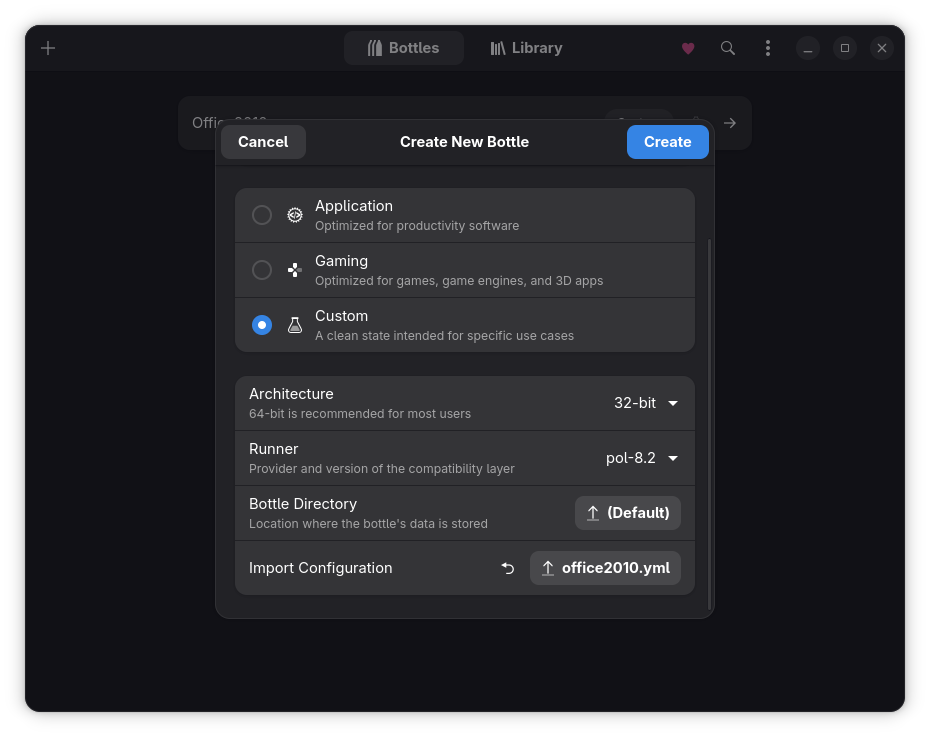
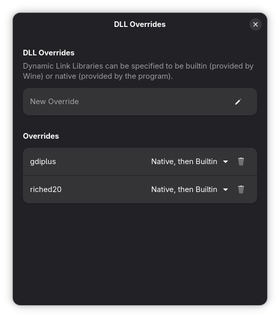
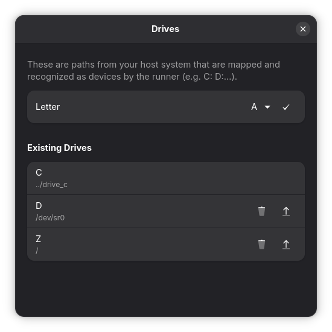
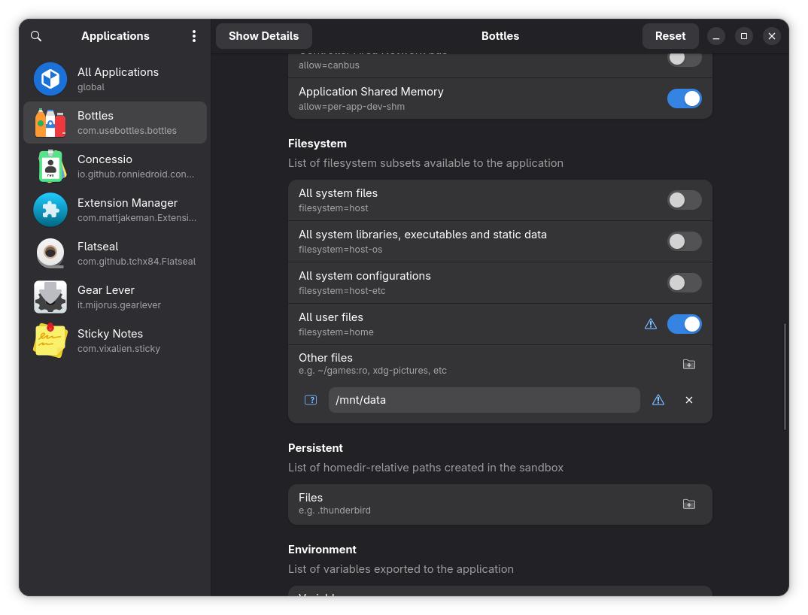

<meta name="google-site-verification" content="eo_b1xV27spOjQRyCrBy2xkRx9D37z1fpF5tve-bA4o" />

[](README.en.md)
[](README.md)
# Microsoft Office 2010 on Linux Using Bottles

Guide for installing Microsoft Office 2010 using Bottles together with Flatseal on Linux, while completely resolving the issue of opening files directly from outside the Flatpak Sandbox environment.

## Requirements

* Linux (with Flatpak installed)
* Bottles (Flatpak)
* Flatseal
* Microsoft Office 2010 Pro Plus VL 32-bit installation package
* UniKey (optional)

---

# 1. Install Wine Runner (PlayOnLinux 8.2)

Current versions of Bottles no longer work reliably with Office 2010 when using some newer Wine runners.

Download and install the `pol-8.2` runner:

```bash
mkdir -p ~/.var/app/com.usebottles.bottles/data/bottles/runners/pol-8.2 && \
wget https://www.playonlinux.com/wine/binaries/phoenicis/upstream-linux-x86/PlayOnLinux-wine-8.2-upstream-linux-x86.tar.gz \
-O /tmp/PlayOnLinux-wine-8.2-upstream-linux-x86.tar.gz && \
tar -xz -C ~/.var/app/com.usebottles.bottles/data/bottles/runners/pol-8.2 \
--strip-components=1 \
-f /tmp/PlayOnLinux-wine-8.2-upstream-linux-x86.tar.gz && \
rm /tmp/PlayOnLinux-wine-8.2-upstream-linux-x86.tar.gz
```

---

# 2. Create a Bottle

Create a new Bottle with the following configuration:



---

# 3. Configure the Bottle

## DLL Overrides

```text
Settings
 └── DLL Overrides
```

Add:

```text
gdiplus
riched20
```



## Mount the Z Drive

```text
Settings
 └── Manage Drives
```

Mount the Z drive to the root directory of the Linux system.



Purpose:

* Allow Office to access files from the Linux filesystem.
* Prepare for the path-fix workaround when opening files directly.

## Flatseal

Grant Bottles access permissions to directories as needed.

Example:



---

# 4. Install Office

Inside the Bottle:

```text
Run Executable
```

Run:

```text
setup.exe
```

and proceed with the Microsoft Office 2010 installation.

---

# 5. Install UniKey (For Vietnamese)

Download it from the official website:

https://www.unikey.org/

Then:

* Select **Browse C:/ Drive** in Bottles.
* Copy `UniKeyNT.exe` into the C drive.

---

# 6. Create Shortcuts

Use:

```text
Programs
 └── Add Shortcut
```

Create shortcuts for:

* Word
* Excel
* PowerPoint
* UniKey ...

Then click the three-dot menu (...) and select:

```text
Add Desktop Entry
```

Office 2010 executables are located at:

```text
C:\Program Files\Microsoft Office\Office14
```

---

# 7. Fix the Issue of Opening Files Directly from Linux

## Cause

Bottles runs inside a Flatpak Sandbox environment.

When:

* Double-clicking a file
* Using Open With...
* Opening from a File Manager

the Linux path is often incorrectly converted into a Windows path.

---

## Solution

Use a script to convert Linux paths → Windows paths.

### Word

File:

```bash
open-word.sh
```

### Excel

File:

```bash
open-excel.sh
```

You can create similar files for other applications as needed.

## Install the Scripts

Copy the scripts into:

```bash
~/.local/bin
```

Make them executable:

```bash
chmod +x ~/.local/bin/open-word.sh
chmod +x ~/.local/bin/open-excel.sh
```

---

## Modify the Desktop Entry

Open the directory:

```bash
~/.local/share/applications
```

Find the desktop files created by Bottles.

Example:

```text
com.usebottles.bottles.App_xxxxxxxxx.desktop
```

Change the following line:

```ini
Exec=
```

to:

### Word

```ini
Exec=/home/<username>/.local/bin/open-word.sh %f
```

### Excel

```ini
Exec=/home/<username>/.local/bin/open-excel.sh %f
```

Then save the file.

(Repeat the same process for other applications.)

---

# ⚠️ IMPORTANT UPDATE

---

# DATE: 2026-06-07

The POL 8.2 runner exhibits crash issues when interacting with windows, saving files, and working with graphical objects such as shapes.

## Solution: Switch to Wine 7.0 Runner

Download and install the Wine 7.0 runner:

```ini
mkdir -p ~/.var/app/com.usebottles.bottles/data/bottles/runners/wine-7.0 && \
wget https://github.com/Kron4ek/Wine-Builds/releases/download/7.0/wine-7.0-x86.tar.xz \
-O /tmp/wine-7.0-x86.tar.xz && \
tar -xJf /tmp/wine-7.0-x86.tar.xz \
-C ~/.var/app/com.usebottles.bottles/data/bottles/runners/wine-7.0 \
--strip-components=1 && \
rm /tmp/wine-7.0-x86.tar.xz
```

Open the Bottle where Office 2010 is installed, switch the runner to Wine 7.0, and continue using it normally.

---

# DATE: 2026-06-09

## Testing Wine Runners from 7.0 to 7.22 (excluding nearby versions from 5.x to 6.x due to file-opening issues)

* Results show that crashes caused by drawing graphical objects begin with version 7.20. Therefore, version 7.19 was selected because it offers better UI compatibility and fixes instability issues when typing Vietnamese.
* Additional testing is still required to verify whether the current path-conversion script is actually responsible for crashes when opening multiple files from outside the Bottle due to the creation of new instances (**NOT YET RESOLVED**). For now, launch the application from within Bottles and continue testing.

Download and install the Wine 7.19 runner:

```ini
mkdir -p ~/.var/app/com.usebottles.bottles/data/bottles/runners/wine-7.19 && \
wget https://github.com/Kron4ek/Wine-Builds/releases/download/7.19/wine-7.19-x86.tar.xz \
-O /tmp/wine-7.19-x86.tar.xz && \
tar -xJf /tmp/wine-7.19-x86.tar.xz \
-C ~/.var/app/com.usebottles.bottles/data/bottles/runners/wine-7.19 \
--strip-components=1 && \
rm /tmp/wine-7.19-x86.tar.xz
```

---

# DATE: 2026-06-11

## Path Conversion Script Update

* Test results show that creating a new instance every time a file is opened can crash the entire Wine environment.
* Solution: Check whether the application is already running before opening the file. If an existing process is found, use `start.exe` to pass the file to the running process instead of creating a new instance.
* Additionally, opening too many files at once, especially files with linked data sources, may overload `wineserver` => **WINE LIMITATION**

---

# Notes

> [!WARNING]
> **(IMPORTANT)** <br>
> Rename the Bottle, username, script files, and command lines according to your own system before use.

Test environment:

* Arch Linux
* GNOME
* Bottles (Flatpak)
* Wine Runner: PlayOnLinux 8.2
* Microsoft Office 2010 Pro Plus VL 32-bit

Reference source and Bottle configuration files from: https://github.com/Rustring/MsOffice-On-WineBottles-Improved
