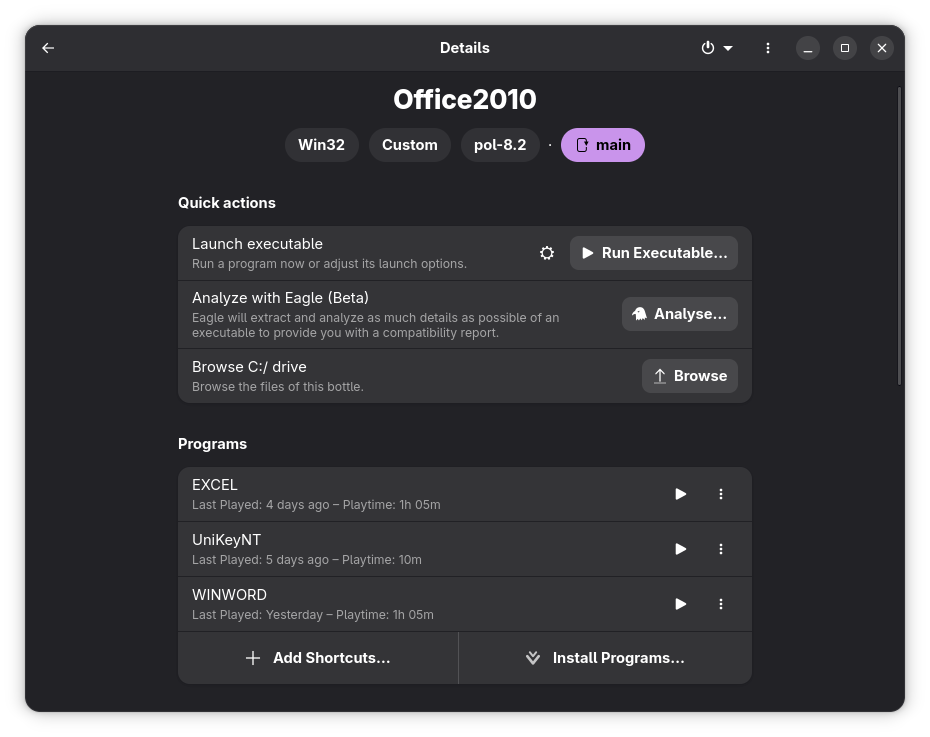

# Microsoft Office 2010 trên Linux bằng Bottles

Hướng dẫn cài đặt Microsoft Office 2010 bằng Bottles kết hợp Flatseal trên Linux, đồng thời xử lý triệt để lỗi mở file trực tiếp từ bên ngoài môi trường Flatpak Sandbox.

## Yêu cầu

- Linux (đã cài Flatpak)
- Bottles (Flatpak)
- Flatseal
- Bộ cài Microsoft Office 2010 Pro Plus VL 32-bit
- UniKey (tùy chọn)

---

# 1. Cài Wine Runner (PlayOnLinux 8.2)

Bottles hiện tại không còn hoạt động ổn định với Office 2010 khi sử dụng một số Wine Runner mới.

Tải và cài runner `pol-8.2`:

```bash
mkdir -p ~/.var/app/com.usebottles.bottles/data/bottles/runners/pol-8.2 && \
wget https://www.playonlinux.com/wine/binaries/phoenicis/upstream-linux-x86/PlayOnLinux-wine-8.2-upstream-linux-x86.tar.gz \
-O /tmp/PlayOnLinux-wine-8.2-upstream-linux-x86.tar.gz && \
tar -xz -C ~/.var/app/com.usebottles.bottles/data/bottles/runners/pol-8.2 \
--strip-components=1 \
-f /tmp/PlayOnLinux-wine-8.2-upstream-linux-x86.tar.gz && \
rm /tmp/PlayOnLinux-wine-8.2-upstream-linux-x86.tar.gz
```

---

# 2. Tạo Bottle

Tạo Bottle mới với cấu hình như sau:


---

# 3. Cấu hình Bottle

## DLL Overrides
```text
Settings
 └── DLL Overrides
```

Thêm:

```text
gdiplus
riched20
```

## Mount ổ Z
```text
Settings
 └── Manage Drives
```

Mount ổ Z tới thư mục gốc hệ thống Linux.

Mục đích:

- Cho phép Office truy cập file từ hệ thống.
- Chuẩn bị cho bước sửa lỗi đường dẫn khi mở file trực tiếp.

## Flatseal
Cấp quyền truy cập thư mục cho Bottles theo nhu cầu.
Ví dụ:


---

# 4. Cài đặt Office

Trong Bottle:

```text
Run Executable
```

Chạy:

```text
setup.exe
```

và tiến hành cài đặt Microsoft Office 2010.

---

# 5. Cài UniKey (Tùy chọn)

Tải từ website chính thức:

https://www.unikey.org/

Sau đó:

- Chọn **Browse C:/ Drive** trong Bottles.
- Copy file `UniKeyNT.exe` vào ổ C.

---

# 6. Tạo Shortcut

Sử dụng:

```text
Programs
 └── Add Shortcut
```

Tạo shortcut cho:

- Word
- Excel
- PowerPoint
- UniKey

Sau đó nhấn dấu ba chấm (...) và chọn:

```text
Add Desktop Entry
```

File Office nằm tại:

```text
C:\Program Files\Microsoft Office\Office14
```

---

# 7. Khắc phục lỗi mở file trực tiếp từ Linux

## Nguyên nhân

Bottles chạy trong môi trường Flatpak Sandbox.

Khi:

- Double click file
- Open With...
- Mở từ File Manager

đường dẫn Linux thường bị chuyển đổi sai sang đường dẫn Windows.

---

## Giải pháp

Sử dụng script chuyển đổi đường dẫn Linux → Windows.

### Word

File:

```bash
open-word.sh
```

```bash
#!/bin/bash

FILE="$1"

WINPATH="Z:${FILE//\//\\}"
WINPATH="\"$WINPATH\""

flatpak run --command=bottles-cli com.usebottles.bottles run \
  -b Office2010 \
  -e "C:\Program Files\Microsoft Office\Office14\WINWORD.EXE" \
  --args-replace \
  "$WINPATH"
```

### Excel

File:

```bash
open-excel.sh
```

```bash
#!/bin/bash

FILE="$1"

WINPATH="Z:${FILE//\//\\}"
WINPATH="\"$WINPATH\""

flatpak run --command=bottles-cli com.usebottles.bottles run \
  -b Office2010 \
  -e "C:\Program Files\Microsoft Office\Office14\EXCEL.EXE" \
  --args-replace \
  "$WINPATH"
```

---

## Cài đặt Script

Copy script vào:

```bash
~/.local/bin
```

Cấp quyền thực thi:

```bash
chmod +x ~/.local/bin/open-word.sh
chmod +x ~/.local/bin/open-excel.sh
```

---

## Chỉnh sửa Desktop Entry

Mở thư mục:

```bash
~/.local/share/applications
```

Tìm các file desktop do Bottles tạo.

Ví dụ:

```text
com.usebottles.bottles.App_xxxxxxxxx.desktop
```

Sửa dòng:

```ini
Exec=
```

thành:

### Word

```ini
Exec=/home/<username>/.local/bin/open-word.sh %f
```

### Excel

```ini
Exec=/home/<username>/.local/bin/open-excel.sh %f
```

Sau đó lưu lại.

---

# Kết quả

Sau khi hoàn tất:

- Microsoft Word mở trực tiếp từ File Manager.
- Microsoft Excel mở trực tiếp từ File Manager.
- Không còn lỗi đường dẫn của Flatpak.
- Hỗ trợ mở file bằng:
  - Double click
  - Open With...
  - Recent Files
  - File Manager



---

# Tệp đi kèm

Repository bao gồm:

```text
README.md
office2010.yml
open-word.sh
open-excel.sh
Image/
```

---

# Ghi chú

Dự án được xây dựng và kiểm thử trên:

- Arch Linux
- Gnome
- Bottles (Flatpak)
- Wine Runner: PlayOnLinux 8.2
- Microsoft Office 2010 Pro Plus VL 32-bit